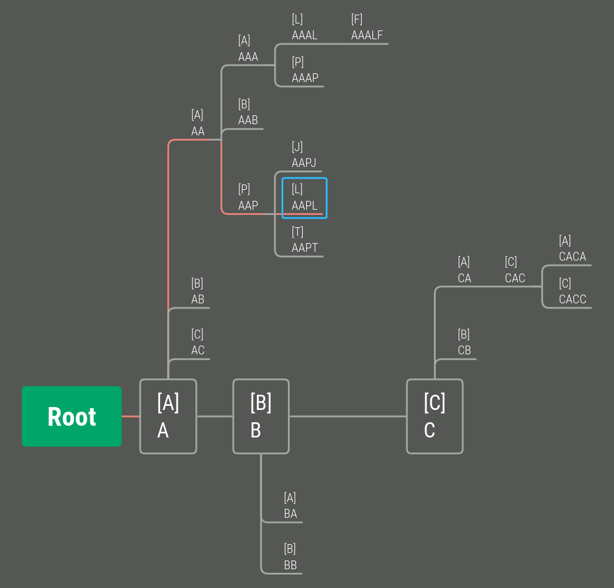

# In-memory search index



## Features

- Indexation using simple tree
- Search by beginning of string
- Exact search
- Suitable for non-long strings

## How to use

```go
package main

import (
    "fmt"
    "github.com/twelvedata/searchindex"
)

type SymbolInfo struct {
    Symbol     string
    Exchange   string
    Instrument string
}

func main() {
    // Values for indexation
    searchList := searchindex.SearchList{
        &searchindex.SearchItem{
            Key: "AAPL",
            Data: &SymbolInfo{Symbol: "AAPL", Exchange: "NASDAQ", Instrument: "Apple Inc"},
        },
        &searchindex.SearchItem{
            Key: "AMZN",
            Data: &SymbolInfo{Symbol: "AMZN", Exchange: "NASDAQ", Instrument: "Amazon.com Inc"},
        },
    }

    // Fill index
    searchIndex := searchindex.NewSearchIndex(searchList, 10, nil, nil, true, nil)

    // Search
    result := searchIndex.Search(searchindex.SearchParams{
        Text: "aa",
        OutputSize: 10,
        Matching: searchindex.Beginning,
    })

    fmt.Println(result[0])
}
```

Run tests:

```bash
make test
```
